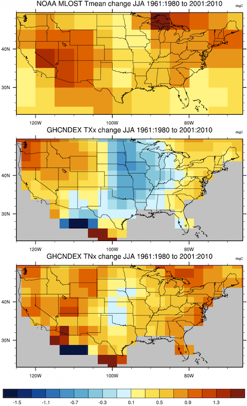
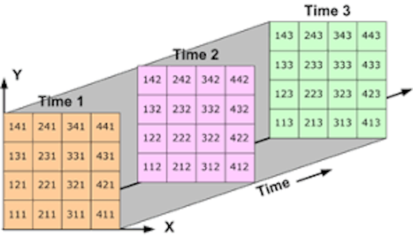
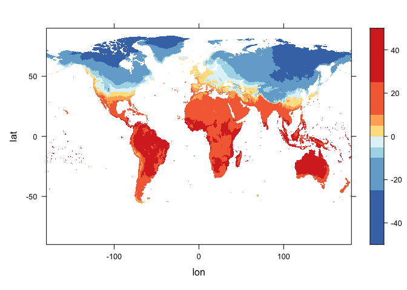
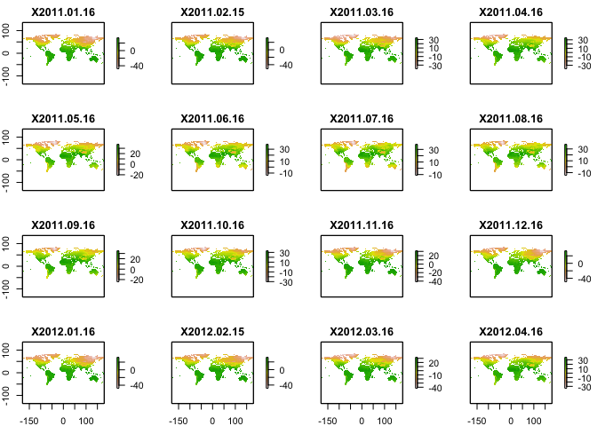
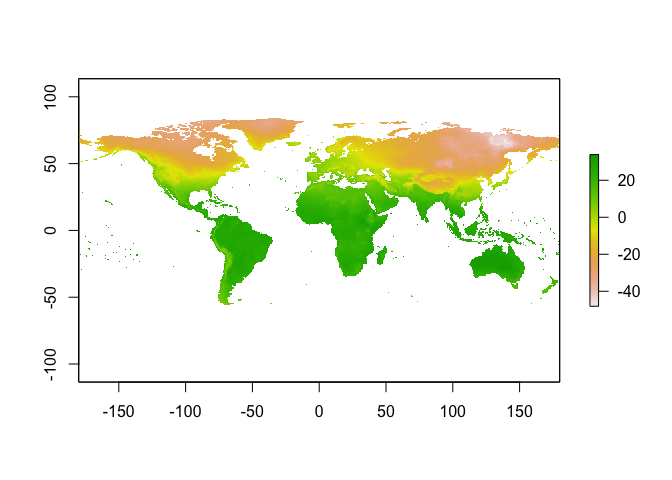
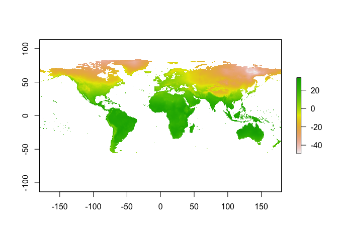
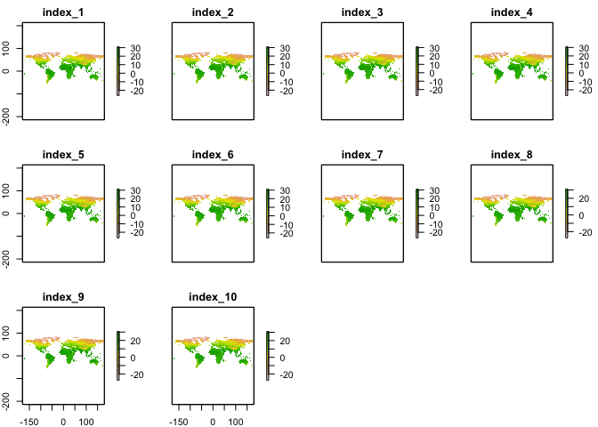
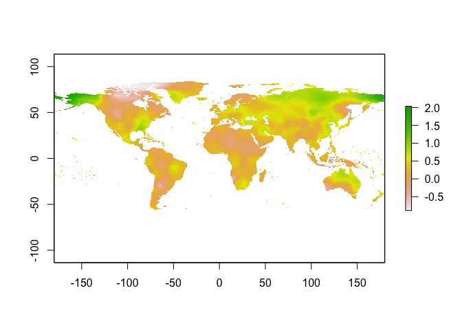

Working with Climate Data - NICAR 2022
================
Nassos Stylianou & Becky Dale, BBC Data Team
21/02/2022

## What is gridded climate data?

A lot of climate data is often stored in a gridded format. This is when
a geographical area is split up into a grid made up of square cells,
with data values (could be variables like temperature or precipitation)
assigned to each cell in that grid representing the value for the area
of the cell. Gridded climate data also tends to have separate layers,
one for a different period of time.



At the BBC News data team, we have used gridded climate data and a lot
of the techniques below, especially for working with the data and the
file formats involved to produce news stories and interactive projects
like these:

-   [How much warmer is your
    city?](https://www.bbc.co.uk/news/resources/idt-985b9374-596e-4ae6-aa04-7fbcae4cb7ee)
-   [What will climate change look like in your
    area?](https://www.bbc.co.uk/news/resources/idt-d6338d9f-8789-4bc2-b6d7-3691c0e7d138)
-   [World now sees twice as many days over
    50C](https://www.bbc.co.uk/news/science-environment-58494641)

In this tutorial, we will be going through how the format and structure
of gridded climate datasets, how to quickly plot such files in bespoke
software like Panoply and moving onto how to work with and analyse the
data in R using specialised packages. By the end of the tutorial, you
should have gained an understanding of the structure of gridded climate
data in netCDF format and be able to extract and reshape the data. You
should also be able to run some basic mathematical calculations on the
data in R, as well as plotting them and exporting them for further
visualisation in other platforms.

## What are netCDF files?

One of the most common file formats used to store gridded climate data,
such as those generated by climate simulation or reanalysis models, is
the *Network Common Data Form*, or
[netCDF](https://www.unidata.ucar.edu/software/netcdf/), often stored
with the suffix `.nc`. You may often see it described as `netCDF4`,
which is the latest version of the netCDF data format and collection of
associated software libraries.

NetCDF files contain metadata that describes what is contained in a
file, such as the latitude and longitude layout of the grid, the names
and units of variables in the data set, and “attributes” that describe
things like missing value codes, or offsets and scale factors that may
have been used to compress the data.

The first thing to get your head round before diving in is the structure
of a netCDF file. They are multi-dimensional arrays, which often hold
data in numerous ‘bands’, these tend to be related to time, for example
there could be one band for each month or year, and each band tends to
have three dimensions, which tend to be latitude, longitude and the
value (temperature, rainfall, number of days over X degrees or whatever
else).



## How can you work with gridded data?

There are a number of different ways, software and packages to work with
gridded climate data and specifically netCDF files. In both Python and
R, there are a number of libraries that make working with gridded data
and multi-dimensional arrays easier. You can also useGIS software like
[QGIS](https://qgis.org/en/site/) to view and work with gridded data -
they are pretty much raster files. Software like
[Panoply](https://www.giss.nasa.gov/tools/panoply/), developed by NASA,
is also a great to get an initial feel of the data and visualise it.

For this tutorial, we will be working with a gridded dataset of average
(mean) monthly temperatures. The dataset is from [CRU TS (Climatic
Research Unit gridded Time
Series)](https://www.nature.com/articles/s41597-020-0453-3) and is on a
0.5° latitude by 0.5° longitude grid over all land domains of the world
except Antarctica. It is derived by the interpolation of monthly climate
anomalies from extensive networks of weather station observations.

The specific [file we will be working with can be downloaded at this
link](https://crudata.uea.ac.uk/cru/data/hrg/cru_ts_4.05/cruts.2103051243.v4.05/tmp/cru_ts4.05.2011.2020.tmp.dat.nc.gz),
while plenty more [CRUTS high resolution gridded dataset can be found at
this link](https://crudata.uea.ac.uk/cru/data/hrg/cru_ts_4.05/).

## Viewing your data in Panoply

As mentioned, you want to get familiar with the structure of your netCDF
file. We will go through all of this in R as well, but it sometimes
really help to first see it visually, and Panoply is a real help.

To have a quick look at the shape and visual impact of the data, it
probably makes sense to load it into Panoply.


When you open the Panoply application, it will ask you to load a file -
you should navigate to the folder in your local directory where the file
is located, select it and click Open. So after opening Panoply and
selecting the file we want to view, you can see that the variables are
on the left and also the metadata is on the right.


From here, you can examine the dimensions of your data, that it has 720
longitude units (formatted in degrees east rather, so 0 to 360 rather
than the more digital map -180 to 180), 120 units of time (which is one
every month from 2011 to 2020) and much more. The more you explore this
and the more you get used to the formats, the more you can read into
them and understand, so don’t worry if not too much makes sense at this
stage.

Now if you double-click on the ‘near-surface temperature’ variable,
which is essentially the variable with the values you want, you will get
a pop-up with some options for what exact plot you want to show.


### Making maps

We want to see it on a map, so we keep the default selection which is to
‘create a georeferenced Longitude-Latitude plot’, a.k.a a map :)

And this is what you should see when you click Create - this may be
slightly different based on your default settings.


We will get back to what the map shows, all our options and and making
it look nice in a bit, but if you click on the Array 1 tab on the top
right, you can see the data as a table. We can see a large number of NAs
in our data, because our file has no data for the ocean, but if we
scroll we can see the data it holds at longitudes and latitudes covered
by land.


So as you can see from the annotation, you can change the time band and
in this way look at another year - as well as playing around with the
colour scales, defaults and the like to get the map looking nicer
through the options in the `Window` menu.

An important thing to bear in mind - in the scale option, make sure that
for your scale range, the min and max are adjusted to ‘fit to data’,
when looking at doing individual plots - as you may not want the scale
for the entire dataset to be the same for different layers (we have kept
it the same in the examples below to compare the temperature from the
different months).

#### January 2011


#### August 2020


So if you experiment with it, Panoply does offer a few options to modify
the map, changing projection, breaks etc so you could in fact export a
series of maps from here as vectors (PDF) and work with them in
Illustrator to modify and have your visualisations directly from here
potentially.

It will even let you do some basic calculations, by checking the
‘Combine Plot’ option at the top, you can add more layers to your data
and do calculations with the individual layers (arrays) you have chosen.
For example, the screenshot below shows a combined plot showing the
difference in the January 2020 temperature data and the 2011 January
temperature data.

 But to really
explore your data and run more comprehensive statistical analyses on
that data, we can bring it into R and examine it there, which is what we
will be doing in the next section.

## Working with your data in R

There are a number of different packages in R that allow you to load in
and work with gridded netCDF files. Packages like the `raster` package,
or the relatively newer `tidync` help do a lot of the heavy loading, but
it is crucial to really understand how these multi-dimensional array
files are structured first up, which is what we will go through now,
mainly using the functions from the `ncdf4` R package.

### Load the packages you need

``` r
library(ncdf4) # package for netcdf manipulation
library(raster) # package for raster manipulation
library(RNetCDF) # package for working with netcdfs
library(rgdal) # package for geospatial analysis
library(dplyr) #package for data manipulation in R
library(lubridate) #package  for working with dates in R
library(lattice) #package for data visualisation and graphics in R
library(RColorBrewer) #package  for colour scales in R
```

### Reading a gridded file into R

You can open a netcdf file using the `nc_open()` function from the
`ncdf4` library.

At its simplest, all you need is the filepath of your netcdf file, and
the data from the file into a new variable you can access in R.

The file we are using is inside our `data` folder. So all you need to do
to load it in is run the code below, which loads the netCDF file and
saves it as a variable we are calling `nc_data`:

``` r
# This loads the data in and saves it to a variable called nc_data
nc_data <- nc_open('data/cru_ts4.05.2011.2020.tmp.dat.nc')

# To see some basic information about the data, print out the file. 
print(nc_data)
```

    ## File data/cru_ts4.05.2011.2020.tmp.dat.nc (NC_FORMAT_CLASSIC):
    ## 
    ##      2 variables (excluding dimension variables):
    ##         float tmp[lon,lat,time]   
    ##             long_name: near-surface temperature
    ##             units: degrees Celsius
    ##             correlation_decay_distance: 1200
    ##             _FillValue: 9.96920996838687e+36
    ##             missing_value: 9.96920996838687e+36
    ##         int stn[lon,lat,time]   
    ##             description: number of stations contributing to each datum
    ##             _FillValue: -999
    ##             missing_value: -999
    ## 
    ##      3 dimensions:
    ##         lon  Size:720
    ##             long_name: longitude
    ##             units: degrees_east
    ##         lat  Size:360
    ##             long_name: latitude
    ##             units: degrees_north
    ##         time  Size:120   *** is unlimited ***
    ##             long_name: time
    ##             units: days since 1900-1-1
    ##             calendar: gregorian
    ## 
    ##     8 global attributes:
    ##         Conventions: CF-1.4
    ##         title: CRU TS4.05 Mean Temperature
    ##         institution: Data held at British Atmospheric Data Centre, RAL, UK.
    ##         source: Run ID = 2103051243. Data generated from:tmp.2103041709.dtb
    ##         history: Fri  5 Mar 13:25:53 GMT 2021 : User harry : Program makegridsauto.for called by update.for
    ##         references: Information on the data is available at http://badc.nerc.ac.uk/data/cru/
    ##         comment: Access to these data is available to any registered CEDA user.
    ##         contact: support@ceda.ac.uk

When you print the variable, you will see some basic information about
the netCDF, which resembles the metadata of the file. It does not print
the data as a standard dataframe would for example. You can also gain an
insight into the complicated structure of the information stored.

We can see that there are two variables, the `tmp` variable in degrees
Celsius, which is the surface temperature, and the `stn` variable, which
is the “number of stations contributing to each datum”.

The data is structured in three dimensions: longitude (`lon`), latitude
(`lat`) and time, which is what we will look at first.

We can also find the names of the different dimensions and variables in
R, if we run `View(nc_data)`. Running the `View()` function should open
up a new tab in R, which shows us all the different list elements of the
netCDF file. You can click on the `dim` and `var` lists to see the names
of the dimensions and variables.

NetCDF files and the data within them are naturally raster ‘slabs’ (a
longitude by latitude “slice”), bricks (a longitude by latitude by
time), or 4-d arrays (e.g. a longitude by latitude by height by time),
while most data analysis routines in R expect 2-d
variable-by-observation data frames.

So, what we will be doing next is to look at how to extract and work
with each of the dimensions and variables, how they are structured
before re-shaping it from its list/raster format to a more
‘rectangular’, dataframe-like format.

### Extracting variables

To extract data from the netCDF, we can use the `ncvar_get()` function,
also from the `ncdf4` package. The first argument you should pass to the
function is the name of your netCDF file in R (the name you have given
the netCDF file you have brought into R using the `nc_open` function)
and the second argument is the name of the variable (dimension in this
case) we want to extract. The `ncvar_get()` function actually extracts
the data as arrays, so we will need to do some formatting to them later
on to change the data type.

#### Longitude

So let’s start with the longitude. We know that the longitude is stored
in the variable/dimension called “lon” as we can see that in the
metadata above, under the dimensions.

``` r
# The line of code below extracts the longitude variable from the netcdf file as an array into the lon variable.
lon <- ncvar_get(nc_data,"lon")

# Using the dim() function and passing our new lon variable to it gives us the dimensions of the l and saves it to the nlon variable.
nlon <- dim(lon)

# These functions just give you some insight into the data within lon 
head(lon)
```

    ## [1] -179.75 -179.25 -178.75 -178.25 -177.75 -177.25

``` r
tail(lon)
```

    ## [1] 177.25 177.75 178.25 178.75 179.25 179.75

``` r
max(lon)
```

    ## [1] 179.75

``` r
min(lon)
```

    ## [1] -179.75

Running the different `head`, `tail`, `max` and `min` functions will
show you the first few and last few latitude and longitude values for
your data, which are in essence the centre points of your grid in the
raster dataset.

You can also see that `the ncvar_get()` function has actually extracted
the data as a 1D array.

#### Latitude

We then need to do the same with the latitude, to have both the
longitude and latitude in different variables. Again, we’ve seen above
that the latitude data is stored within the `lat` dimension.

``` r
# The line of code below extracts the latitude variable from the netcdf file as an array into the lat variable.
lat <- ncvar_get(nc_data,"lat")
# Using the dim() function and passing our new lat variable to it gives us the dimensions of the lat and saves it to the nlat variable.
nlat <- dim(lat)
# These functions just give you some insight into the lat variable
head(lat)
```

    ## [1] -89.75 -89.25 -88.75 -88.25 -87.75 -87.25

``` r
tail(lat)
```

    ## [1] 87.25 87.75 88.25 88.75 89.25 89.75

``` r
max(lat)
```

    ## [1] 89.75

``` r
min(lat)
```

    ## [1] -89.75

#### Time

The next step is to extract the time variable from your dataset - this
is a little trickier because the time variable will need to be
interpreted based on the time units, it is rarely a straightforward
‘date’ when working with climate data.

To find out what time unit you are dealing with for the specific dataset
in question, a lot of the time this should be in the metadata
information that you get when you `print()` the netCDF dataset after you
have loaded it in. So if we look at the information printed out for this
dataset, you can see the `units` for the `time` dimension are
`days since 1900-1-1`.

``` r
time <- ncvar_get(nc_data,"time")

time
```

    ##   [1] 40557 40587 40616 40647 40677 40708 40738 40769 40800 40830 40861 40891
    ##  [13] 40922 40952 40982 41013 41043 41074 41104 41135 41166 41196 41227 41257
    ##  [25] 41288 41318 41347 41378 41408 41439 41469 41500 41531 41561 41592 41622
    ##  [37] 41653 41683 41712 41743 41773 41804 41834 41865 41896 41926 41957 41987
    ##  [49] 42018 42048 42077 42108 42138 42169 42199 42230 42261 42291 42322 42352
    ##  [61] 42383 42413 42443 42474 42504 42535 42565 42596 42627 42657 42688 42718
    ##  [73] 42749 42779 42808 42839 42869 42900 42930 42961 42992 43022 43053 43083
    ##  [85] 43114 43144 43173 43204 43234 43265 43295 43326 43357 43387 43418 43448
    ##  [97] 43479 43509 43538 43569 43599 43630 43660 43691 43722 43752 43783 43813
    ## [109] 43844 43874 43904 43935 43965 43996 44026 44057 44088 44118 44149 44179

So if we look at our time data when we print it out after we have
extracted it using, we get a number like `40557`, as you can see above.
We know from the information we have that number represents days since
the 1 January 1900.

This will need to be factored in to convert the formats a little later
on, as it will be really useful to use the actual date when we are
working with the data.

To actually turn the units from the time dimension into a variable, we
use the `ncatt_get()` function to extract the units attribute

``` r
tunits <- ncatt_get(nc_data,"time","units")

# And just like the lat and lon, we can get the time variable dimensions as well using the dim() function.
ntime <- dim(time)
```

### Converting the time variable

So before reshaping the data format to a 2D dataframe format we can work
with, we will need to convert the time variable.

The time variable in “time-since” units can be converted into actual
time values by turning the time tunits$value string into a date using
the lubridate package and adding the number of days onto it. We then
turn the dates into a character in order to use it as a column header a
little later on when we reshape our data.

``` r
# example of how we can convert time from days since to an actual date

time_cols <- as.character(lubridate::ymd(tunits$value) + time)
```

So if you look at the time values in days since, this is what you get:

``` r
print(time)
```

    ##   [1] 40557 40587 40616 40647 40677 40708 40738 40769 40800 40830 40861 40891
    ##  [13] 40922 40952 40982 41013 41043 41074 41104 41135 41166 41196 41227 41257
    ##  [25] 41288 41318 41347 41378 41408 41439 41469 41500 41531 41561 41592 41622
    ##  [37] 41653 41683 41712 41743 41773 41804 41834 41865 41896 41926 41957 41987
    ##  [49] 42018 42048 42077 42108 42138 42169 42199 42230 42261 42291 42322 42352
    ##  [61] 42383 42413 42443 42474 42504 42535 42565 42596 42627 42657 42688 42718
    ##  [73] 42749 42779 42808 42839 42869 42900 42930 42961 42992 43022 43053 43083
    ##  [85] 43114 43144 43173 43204 43234 43265 43295 43326 43357 43387 43418 43448
    ##  [97] 43479 43509 43538 43569 43599 43630 43660 43691 43722 43752 43783 43813
    ## [109] 43844 43874 43904 43935 43965 43996 44026 44057 44088 44118 44149 44179

If we print out the converted time, this is what we get:

``` r
print(time_cols)
```

    ##   [1] "2011-01-16" "2011-02-15" "2011-03-16" "2011-04-16" "2011-05-16"
    ##   [6] "2011-06-16" "2011-07-16" "2011-08-16" "2011-09-16" "2011-10-16"
    ##  [11] "2011-11-16" "2011-12-16" "2012-01-16" "2012-02-15" "2012-03-16"
    ##  [16] "2012-04-16" "2012-05-16" "2012-06-16" "2012-07-16" "2012-08-16"
    ##  [21] "2012-09-16" "2012-10-16" "2012-11-16" "2012-12-16" "2013-01-16"
    ##  [26] "2013-02-15" "2013-03-16" "2013-04-16" "2013-05-16" "2013-06-16"
    ##  [31] "2013-07-16" "2013-08-16" "2013-09-16" "2013-10-16" "2013-11-16"
    ##  [36] "2013-12-16" "2014-01-16" "2014-02-15" "2014-03-16" "2014-04-16"
    ##  [41] "2014-05-16" "2014-06-16" "2014-07-16" "2014-08-16" "2014-09-16"
    ##  [46] "2014-10-16" "2014-11-16" "2014-12-16" "2015-01-16" "2015-02-15"
    ##  [51] "2015-03-16" "2015-04-16" "2015-05-16" "2015-06-16" "2015-07-16"
    ##  [56] "2015-08-16" "2015-09-16" "2015-10-16" "2015-11-16" "2015-12-16"
    ##  [61] "2016-01-16" "2016-02-15" "2016-03-16" "2016-04-16" "2016-05-16"
    ##  [66] "2016-06-16" "2016-07-16" "2016-08-16" "2016-09-16" "2016-10-16"
    ##  [71] "2016-11-16" "2016-12-16" "2017-01-16" "2017-02-15" "2017-03-16"
    ##  [76] "2017-04-16" "2017-05-16" "2017-06-16" "2017-07-16" "2017-08-16"
    ##  [81] "2017-09-16" "2017-10-16" "2017-11-16" "2017-12-16" "2018-01-16"
    ##  [86] "2018-02-15" "2018-03-16" "2018-04-16" "2018-05-16" "2018-06-16"
    ##  [91] "2018-07-16" "2018-08-16" "2018-09-16" "2018-10-16" "2018-11-16"
    ##  [96] "2018-12-16" "2019-01-16" "2019-02-15" "2019-03-16" "2019-04-16"
    ## [101] "2019-05-16" "2019-06-16" "2019-07-16" "2019-08-16" "2019-09-16"
    ## [106] "2019-10-16" "2019-11-16" "2019-12-16" "2020-01-16" "2020-02-15"
    ## [111] "2020-03-16" "2020-04-16" "2020-05-16" "2020-06-16" "2020-07-16"
    ## [116] "2020-08-16" "2020-09-16" "2020-10-16" "2020-11-16" "2020-12-16"

So you can see that the time-stamps for the particular set of data is
The “time-stamp” for this particular data set is the mid-point of the
interval for each month of the year for 2011 to 2020. There are other
ways in which the “time” associated with a long-term mean is represented
in climate stats, but essentially the code above shows us how to change
the date format from days since to an actual date - whatever that date
ends up representing.

A note on time and formatting - bear in mind there are a number of
different ways that time data will be represented and you can turn it
into more meaningful date formats in different ways once you understand
that date pattern. You do not always have to change the dates in the way
it was done above by unlisting and string spliting, so always be ready
to adapt.

#### Data variable - temperature

We can extract the data from the array in a very similar way. We know
the data variable we are after (temperature) is called `tmp`, so we can
use the same `ncvar_get()` function as we have done to extract our three
dimensions of lon, lat and time.

``` r
tmp_array <- ncvar_get(nc_data, "tmp")
```

When printing out the array, we can see right at the top, we are seeing
the first element of the array and there are 119 more slices, so we are
seeing just the first month.

If we look at all our global environment variables now, we have the
longitude, latitude, time, and temperature arrays. You can now get an
understanding of the dimensions of each of them and how they will fit in
together. The temperature array is a 3D array and matches the dimensions
of the lon, lat and time ones, which are 1D arrays.

So essentially, the dimensions of the array are 720 lons, 360 lats and
120 times (10 years, 12 months for each year).

You can verify this by running `dim(tmp_array)` and the dims of each
variable.

The other really useful thing to find out about your temperature data
variable at this stage is what potential fill value was used for missing
data. This is a common feature of some netcdf files which may be
different to standard dataframes in R. You can find the fill value by
running the `ncatt_get()` function as below - the name of your data as
the first argument, the name of your variable as the second argument and
"\_FillValue" as the third argument

``` r
# Finds the fill value used for missing data for the tmp variable
fillvalue <- ncatt_get(nc_data, "tmp", "_FillValue")
fillvalue
```

    ## $hasatt
    ## [1] TRUE
    ## 
    ## $value
    ## [1] 9.96921e+36

The fill value in this particular case is
`9969209968386869046778552952102584320`.

The best thing to do is probably first, might just be for housekeeping,
replace any fill values with ’NA’s, as would be standard practice in R.
Here’s how:

``` r
# Assigns the fill value used for missing data for the temperature variable to be NA
tmp_array[tmp_array == fillvalue$value] <- NA
```

### Reshaping your data into a dataframe

The first step in the process is to convert the array into a vector -
the code and process below will only work only if the netCDF file - and
by default the data array - follows the “CF” conventions, i.e. that the
variable has been defined to have dimensions nlon by nlat by nt, in that
order. We have seen from interrogating our data above, that this is the
case for our data - and most netCDF data you will encounter should
follow the same format.

So if you remember from earlier, we had turned our data into a really
large ‘temperature’ array by identifying the variable where the
temperature data was held and using the `ncvar_get()` function.

This is what we had done: `tmp_array <- ncvar_get(nc_data,"tmp")`

So once we have our array, what we then need to do is turn it into a
vector

``` r
tmp_vector_long <- as.vector(tmp_array)

head(na.omit(tmp_vector_long))
```

    ## [1] 7.7 7.8 7.8 7.1 7.3 7.2

To check just how long this vector is, run `length(tmp_vector_long)` -
and you can see that the length is **31104000**.

So we know that our data is made up of latitude, longitude, time and
temperature variables. We know that we have 120 time values (12 months
over 10 year) and the number of rows will be the number of longitude
values by the number of latitude values, as these are grids.

So we then reshape the vector into a matrix based on this logic and
using the nlon, nlat and ntime values we created earlier when evaluating
our netcdf dataset.

``` r
# reshape the vector into a matrix
tmp_matrix <- matrix(tmp_vector_long, nrow=nlon*nlat, ncol=ntime)

dim(tmp_matrix)
```

    ## [1] 259200    120

So in total this should give us a matrix sized 259200 (720 lons x 360
lats) by 120 (time), which adds up to **31104000** from earlier. Bear in
mind that we are not just multiplying these two values (720 by 360) to
get our number of rows when creating the matrix, as the number of rows
will depend on the number of latitude and longitude sized grids, so we
use the variables `nlon` and `nlat` we created that are specific to the
dimensions of this specific dataset.

Then reshape that vector into a 259200 by 120 matrix using the
`matrix()` function, and verify that those are its dimension.

S0 lets see what our matrix actually looks like - lets check it without
the NAs, as a lot of the NAs would be for values in the sea, of which
there are many.

``` r
head(na.omit(tmp_matrix))
```

    ##      [,1]     [,2] [,3] [,4] [,5] [,6] [,7] [,8] [,9] [,10] [,11]    [,12]
    ## [1,]  7.7 9.000000  7.6  4.5  4.7  2.3  1.5  1.5  2.7   5.5   6.5 8.800000
    ## [2,]  7.8 9.000000  7.6  4.3  4.5  2.1  1.2  1.3  2.5   5.5   6.6 8.900001
    ## [3,]  7.8 8.900001  7.3  4.1  4.2  1.7  0.9  1.4  2.2   5.4   6.5 8.800000
    ## [4,]  7.1 8.300000  7.1  4.3  4.4  2.2  1.5  1.1  2.3   4.6   5.7 8.200000
    ## [5,]  7.3 8.500000  7.3  4.5  4.5  2.3  1.7  1.2  2.6   4.9   6.0 8.500000
    ## [6,]  7.2 8.200000  7.0  4.1  4.1  1.9  1.4  0.9  2.4   5.0   6.0 8.400001
    ##      [,13] [,14] [,15] [,16] [,17] [,18] [,19] [,20] [,21] [,22] [,23] [,24]
    ## [1,]   9.1   6.5   7.9   4.4   3.8   1.5   2.5   3.9   3.9   4.6   6.1   5.8
    ## [2,]   9.2   6.5   7.9   4.3   3.6   1.3   2.4   3.7   3.7   4.6   6.2   5.9
    ## [3,]   9.2   6.4   7.6   4.1   3.4   0.9   2.2   3.8   3.4   4.4   6.0   5.8
    ## [4,]   8.6   5.5   7.5   4.3   3.1   1.1   1.8   3.5   3.6   3.9   5.6   5.0
    ## [5,]   8.8   5.8   7.7   4.4   3.3   1.3   2.0   3.7   3.8   4.2   5.9   5.3
    ## [6,]   8.7   5.5   7.4   4.1   2.9   0.9   1.7   3.4   3.6   4.3   5.9   5.2
    ##         [,25] [,26] [,27] [,28] [,29] [,30] [,31] [,32] [,33] [,34] [,35] [,36]
    ## [1,] 9.100000   8.1   7.7   7.8   4.2   3.9   3.2   1.3   3.1   5.1   5.2   6.1
    ## [2,] 9.100000   8.1   7.7   7.8   4.0   3.7   2.9   1.1   3.0   5.1   5.3   6.2
    ## [3,] 9.100000   8.0   7.4   7.6   3.7   3.3   2.7   1.2   2.7   5.0   5.2   6.1
    ## [4,] 8.900001   7.4   7.1   7.1   4.0   3.5   3.0   1.0   2.3   4.5   4.4   5.5
    ## [5,] 9.000000   7.6   7.3   7.3   4.1   3.7   3.2   1.1   2.6   4.8   4.8   5.8
    ## [6,] 8.900001   7.3   7.0   7.0   3.7   3.3   2.8   0.8   2.4   4.9   4.8   5.7
    ##      [,37] [,38] [,39] [,40] [,41] [,42] [,43] [,44] [,45] [,46] [,47] [,48]
    ## [1,]   6.5   7.6   6.1   5.8   4.5   3.1   3.3   3.2   3.5   4.9   5.3   6.9
    ## [2,]   6.7   7.6   6.1   5.8   4.3   2.9   3.2   2.9   3.4   4.9   5.4   7.0
    ## [3,]   6.7   7.5   5.8   5.6   4.0   2.5   3.0   3.0   3.1   4.8   5.3   6.9
    ## [4,]   5.8   7.2   5.6   5.1   4.1   2.5   2.2   2.8   2.8   4.1   4.7   6.2
    ## [5,]   6.0   7.4   5.8   5.3   4.2   2.7   2.5   3.0   3.1   4.4   5.0   6.5
    ## [6,]   5.9   7.0   5.6   5.0   3.8   2.3   2.2   2.7   2.9   4.6   5.0   6.4
    ##      [,49] [,50] [,51] [,52] [,53] [,54] [,55] [,56] [,57] [,58] [,59] [,60]
    ## [1,]   7.7   8.1   8.0   6.1   4.6   2.3   1.6   2.4   1.8   4.8   5.8   6.5
    ## [2,]   7.8   8.1   8.0   6.1   4.4   2.0   1.4   2.2   1.7   4.8   5.9   6.7
    ## [3,]   7.8   8.0   7.7   5.9   4.1   1.6   1.2   2.3   1.4   4.7   5.8   6.6
    ## [4,]   7.1   7.5   7.6   5.3   4.1   2.3   1.4   1.9   1.5   3.8   5.2   5.7
    ## [5,]   7.3   7.7   7.8   5.5   4.2   2.5   1.6   2.1   1.8   4.1   5.5   6.0
    ## [6,]   7.2   7.4   7.5   5.2   3.9   2.1   1.3   1.8   1.6   4.2   5.5   5.9
    ##      [,61] [,62]    [,63] [,64] [,65] [,66] [,67] [,68] [,69] [,70] [,71] [,72]
    ## [1,]   8.1   8.0 8.400001   4.4   4.1   5.3   3.5   2.4   5.4   6.3   6.6   7.3
    ## [2,]   8.2   8.0 8.400001   4.3   4.0   5.1   3.3   2.2   5.4   6.3   6.7   7.4
    ## [3,]   8.2   7.9 8.100000   4.1   3.7   4.7   3.1   2.3   5.1   6.2   6.6   7.3
    ## [4,]   7.7   7.4 8.000000   3.8   3.4   4.5   2.8   2.1   4.2   5.3   6.0   6.5
    ## [5,]   7.9   7.6 8.200000   4.0   3.5   4.8   3.0   2.3   4.6   5.6   6.3   6.8
    ## [6,]   7.8   7.3 7.900000   3.7   3.1   4.4   2.7   2.0   4.4   5.7   6.3   6.8
    ##      [,73]    [,74] [,75] [,76] [,77] [,78] [,79] [,80] [,81] [,82] [,83] [,84]
    ## [1,]   7.9 8.800000   7.5   5.8   4.9   2.0   4.3   3.5   4.0   4.7   6.0   7.1
    ## [2,]   8.0 8.800000   7.5   5.7   4.7   1.9   4.1   3.3   3.9   4.7   6.1   7.2
    ## [3,]   8.0 8.700000   7.2   5.5   4.4   1.5   3.9   3.4   3.6   4.6   6.0   7.1
    ## [4,]   7.2 8.200000   6.8   5.2   4.4   1.4   3.9   3.1   3.4   4.0   5.2   6.3
    ## [5,]   7.4 8.400001   7.0   5.4   4.5   1.7   4.1   3.3   3.7   4.3   5.5   6.6
    ## [6,]   7.4 8.100000   6.7   5.1   4.1   1.3   3.8   3.0   3.5   4.4   5.5   6.5
    ##         [,85]    [,86] [,87] [,88] [,89] [,90] [,91] [,92] [,93] [,94] [,95]
    ## [1,] 8.700000 9.400001   7.0   5.6   4.5   2.7   2.6   3.7   3.4   4.6   6.5
    ## [2,] 8.800000 9.400001   7.1   5.5   4.3   2.5   2.4   3.5   3.3   4.6   6.7
    ## [3,] 8.700000 9.300000   6.8   5.4   4.0   2.1   2.3   3.6   3.1   4.5   6.6
    ## [4,] 8.200000 8.800000   6.4   4.7   3.9   1.9   1.5   3.1   2.4   3.5   5.8
    ## [5,] 8.400001 9.000000   6.6   5.0   4.0   2.1   1.7   3.3   2.7   3.8   6.1
    ## [6,] 8.300000 8.700000   6.3   4.7   3.6   1.8   1.5   3.0   2.6   3.9   6.1
    ##      [,96] [,97] [,98] [,99] [,100] [,101] [,102] [,103] [,104] [,105] [,106]
    ## [1,]   8.2   7.4   7.7   7.7    5.9    4.3    3.2    3.4    2.6    3.3    4.8
    ## [2,]   8.3   7.6   7.7   7.7    5.8    4.1    3.0    3.2    2.4    3.2    4.8
    ## [3,]   8.2   7.6   7.6   7.4    5.7    3.8    2.6    3.0    2.5    3.0    4.7
    ## [4,]   7.6   6.8   7.2   7.2    5.2    4.0    2.5    2.8    1.9    2.5    4.1
    ## [5,]   8.0   7.0   7.4   7.4    5.5    4.1    2.7    3.0    2.1    2.8    4.4
    ## [6,]   7.8   6.9   7.1   7.1    5.2    3.7    2.3    2.7    1.8    2.6    4.5
    ##      [,107] [,108]   [,109]   [,110]   [,111] [,112] [,113] [,114] [,115]
    ## [1,]    6.1    7.9 8.400001 9.200000 8.400001    6.8    5.1    3.0    1.2
    ## [2,]    6.2    8.0 8.500000 9.200000 8.400001    6.8    5.0    2.9    1.1
    ## [3,]    6.1    7.9 8.600000 9.100000 8.000000    6.6    4.7    2.5    0.9
    ## [4,]    5.1    7.3 7.600000 8.500000 8.000000    6.3    4.7    2.2   -0.1
    ## [5,]    5.4    7.6 7.900000 8.700000 8.200000    6.5    4.8    2.4    0.2
    ## [6,]    5.5    7.5 7.800000 8.400001 7.900000    6.2    4.4    2.1    0.0
    ##      [,116] [,117] [,118] [,119] [,120]
    ## [1,]    1.7    3.5    5.1    7.5    7.8
    ## [2,]    1.4    3.3    5.1    7.6    7.9
    ## [3,]    1.5    3.0    5.0    7.5    7.8
    ## [4,]    1.5    3.0    4.5    6.9    7.0
    ## [5,]    1.7    3.3    4.8    7.1    7.3
    ## [6,]    1.4    3.1    4.9    7.1    7.2

So this matrix is basically the temperature data only, so we now need to
add the latitude and longitude values to this, which we can do by
creating a second dataframe and binding the two together.

``` r
# creating lon lat matrix
lonlat_matrix <- as.matrix(expand.grid(lon,lat))

# bind the two matrices together and turn into a dataframe
tmp_dataframe <- data.frame(cbind(lonlat_matrix, tmp_matrix))
```

Essentially, as you can see the dataset starts in the far corners of the
world in a WGS84 system, hence the NAs as there are no values for the
ocean in our dataset.

The other thing that you can see is that there are no column names - so
we can set these ourselves. We know the first two columns are the
longitude and latitude, as when we joined up the lonlat matrix with the
tmp matrix, we put the lonlat matrix first. Then, the column names for
each of the tmp columns are the time columns, so each of the individual
layers in the netCDF that we saw visualised when we explored our data
using Panoply. This is where our time conversion comes into use, as we
can use that to set our column names.

``` r
lon_lat_cols <- c("lon", "lat")

tmp_cols <- c(lon_lat_cols, 
              time_cols)

colnames(tmp_dataframe) <- tmp_cols
```

### Plotting your data

We can have a quick look at our data by slicing up our temperature
array, picking for example the first one, January 2011.

``` r
tmp_slice_january2011 <- tmp_array[,,1]
dim(tmp_slice_january2011)
```

    ## [1] 720 360

``` r
# summary(tmp_slice_january2011)
```

Running the `dim()` funciton on our new array, you can now see it is a
2D array with 720 longitude values and 360 latitude values - worth
checking to make sure everything has been done correctly.

We can quickly visualise how the data looks in a map, using the
`levelplot()` function in the lattice package (you can also visualise in
a number of other ways, but this is a quick one).

The `expand.grid()` function is used to create a set of 720 by 360 pairs
of latitude and longitude values, one for each element in the
temperature array.

``` r
grid <- expand.grid(lon = lon, lat = lat)

 # Sets breakpoints for the map we want to use below -specific values of the cutpoints of temperature categories are defined to cover the range of temperature - you can obviously tweak these and adjust to your data. 
cutpts <- c(-50, -25, -10, -5, 0, 5, 10, 25, 50)

# Visualises data in a map using the levelplot() function from the lattice package - using the grid above and the breakpoints we set above 
lattice::levelplot(tmp_slice_january2011 ~ lon * lat,
            data = grid, at = cutpts, cuts = 11, pretty = T, 
            col.regions = rev(brewer.pal(9, "RdYlBu")))
```

<!-- -->

### Calculations with the raster package

We can also work with our dataset using functions from the `raster`
package. If we load the data in using the `brick` function of the raster
package, the netCDF file is loaded in as a [RasterBrick
object](https://rspatial.org/raster/pkg/2-classes.html#rasterstack-and-rasterbrick),
a type of object that can hold several layers of data. Because our data,
as we have seen earlier, has two variables, we can explicitly select the
`tmp` variable, otherwise it will select one for us and provide a
message with the variable the function has chosen.

``` r
tmp_monthly <- brick('data/cru_ts4.05.2011.2020.tmp.dat.nc', varname = "tmp")

print(tmp_monthly)
```

    ## File /Users/stylin02/bbc/nicar2022/working_with_climate_data_nicar2022/data/cru_ts4.05.2011.2020.tmp.dat.nc (NC_FORMAT_CLASSIC):
    ## 
    ##      2 variables (excluding dimension variables):
    ##         float tmp[lon,lat,time]   
    ##             long_name: near-surface temperature
    ##             units: degrees Celsius
    ##             correlation_decay_distance: 1200
    ##             _FillValue: 9.96920996838687e+36
    ##             missing_value: 9.96920996838687e+36
    ##         int stn[lon,lat,time]   
    ##             description: number of stations contributing to each datum
    ##             _FillValue: -999
    ##             missing_value: -999
    ## 
    ##      3 dimensions:
    ##         lon  Size:720
    ##             long_name: longitude
    ##             units: degrees_east
    ##         lat  Size:360
    ##             long_name: latitude
    ##             units: degrees_north
    ##         time  Size:120   *** is unlimited ***
    ##             long_name: time
    ##             units: days since 1900-1-1
    ##             calendar: gregorian
    ## 
    ##     8 global attributes:
    ##         Conventions: CF-1.4
    ##         title: CRU TS4.05 Mean Temperature
    ##         institution: Data held at British Atmospheric Data Centre, RAL, UK.
    ##         source: Run ID = 2103051243. Data generated from:tmp.2103041709.dtb
    ##         history: Fri  5 Mar 13:25:53 GMT 2021 : User harry : Program makegridsauto.for called by update.for
    ##         references: Information on the data is available at http://badc.nerc.ac.uk/data/cru/
    ##         comment: Access to these data is available to any registered CEDA user.
    ##         contact: support@ceda.ac.uk

If we have a quick try and visualise our data, we can see that we get a
plot for each month. To see just one month, we can select the index to
select that layer and we know there are 120 layers, so we can select any
layer from 1 to 120.

``` r
plot(tmp_monthly)
```

<!-- -->

``` r
plot(tmp_monthly[[1]])
```

<!-- -->

``` r
plot(tmp_monthly[[120]])
```

<!-- -->

The
[stackApply](https://search.r-project.org/CRAN/refmans/raster/html/stackApply.html)
function is useful to apply a function on subsets of RasterBricks. It
comes in handy here as it allows us to run calculations on the data to
produce a single layer each year, rather than each month. We first
create a vector that can act as an index for each year and then using
the years as an index in the stackApply function, can run a mean
function on each of the years.

And you can see when we plot the annual dataset, that it prints out just
10 plots, one for each year, instead of the 120, one for each month

``` r
# creates vector as index for calculating yearly averages

years <- rep(1:10, each = 12)

# calculates average for each year, resulting in 10 layers one for each year from 2011 to 2020
tmp_annual <- stackApply(tmp_monthly, indices = years, fun = mean)


plot(tmp_annual)
```

<!-- -->

We can at this stage convert the data to a spatial data frame for
further analysis and plotting, or to save out as a shapefile or geojson.

When we print out the annual df file, we can see it shows us that we
have 10 variables, one for each year, which are named by year, rather
than index\_1, index\_2 etc.

``` r
#turn into spatial polygons data frame
tmp_annual_df <- as(tmp_annual,
                  "SpatialPolygonsDataFrame")

# turn names of variables in the data frame as years
names(tmp_annual_df@data) <- c(as.character(2011:2020))

print(tmp_annual_df)
```

    ## class       : SpatialPolygonsDataFrame 
    ## features    : 67420 
    ## extent      : -180, 180, -56, 84  (xmin, xmax, ymin, ymax)
    ## crs         : +proj=longlat +datum=WGS84 +no_defs 
    ## variables   : 10
    ## names       :              2011,              2012,             2013,              2014,              2015,              2016,             2017,              2018,              2019,              2020 
    ## min values  : -26.2833341757456, -26.5166671276093, -27.191666841507, -26.8666671117147, -26.8749999205271, -25.8666671911875, -26.800000667572, -27.6083339850108, -27.4000004728635, -27.4000004728635 
    ## max values  :  30.9833343823751,  31.0583338737488, 31.2333340644836,   30.841667175293,  31.4166669845581,  31.4000005722046, 31.2333339055379,  31.0500003496806,  30.9083340962728,  31.0250005722046

We can also split the data by subsetting it, creating two different
files for the years 2011 to 2015 and 2016 to 2020 and calculating the
total average for each.

``` r
# subsets years 2011 to 2015, the first 5 years in our annual data
tmp_annual_2011_2015 <- subset(tmp_annual, 1:5)

# calculates the mean for the five years we have subset
tmp_2011_2015_avg <- calc(tmp_annual_2011_2015,
                        mean,
                        na.rm = TRUE) 

# subsets years 2016 to 2020, years 6 to 10 in our annual data
tmp_annual_2016_2020 <- subset(tmp_annual, 6:10)

# calculates the mean for the five years we have subset
tmp_2016_2020_avg <- calc(tmp_annual_2016_2020,
                        mean,
                        na.rm = TRUE) 
```

So now, we can compare the average for the first five years of our data
to the last five years and figure out the difference in mean temperature
between the two, an example of the type of calculations we can get into
with our data formatted in this way.

We can see when plotting the new map, or printing out the results, that
the values show the difference between the two averages, as opposed to
the mean temperature averages.

``` r
# calculates the difference between the two averages 
tmp_avg_diff <- tmp_2016_2020_avg - tmp_2011_2015_avg
print(tmp_avg_diff)
```

    ## class      : RasterLayer 
    ## dimensions : 360, 720, 259200  (nrow, ncol, ncell)
    ## resolution : 0.5, 0.5  (x, y)
    ## extent     : -180, 180, -90, 90  (xmin, xmax, ymin, ymax)
    ## crs        : +proj=longlat +datum=WGS84 +no_defs 
    ## source     : memory
    ## names      : layer 
    ## values     : -0.8883338, 2.035  (min, max)

``` r
plot(tmp_avg_diff)
```

<!-- -->

``` r
tmp_avg_diff_df <- as(tmp_avg_diff, 
                    "SpatialPolygonsDataFrame")
```

We can also export the data as a tiff, if we want to style up the end in
software like QGIS.

``` r
# export as GeoTIFF
writeRaster(tmp_avg_diff, 
            filename="tmp_avg_diff.tiff", 
            format = "GTiff",
            overwrite = TRUE)
```
