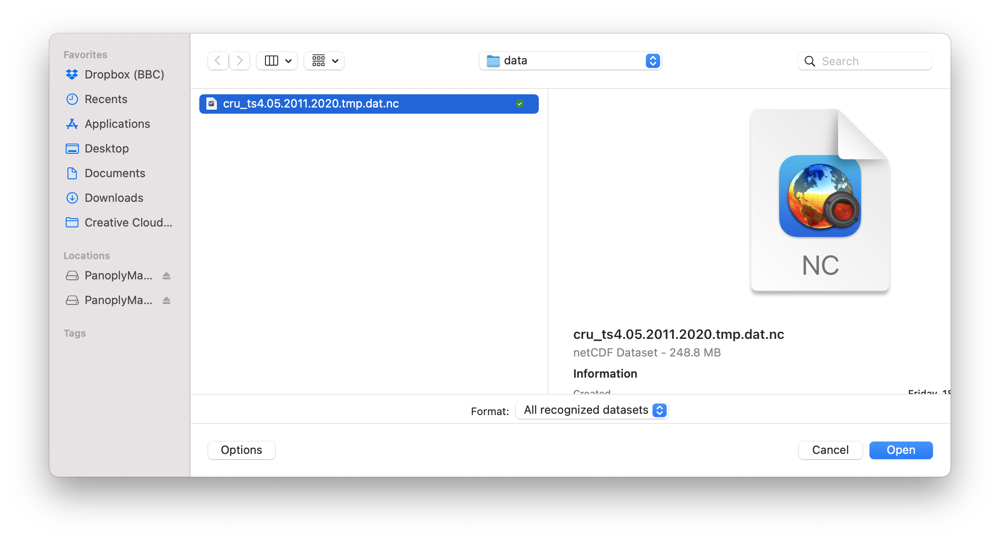
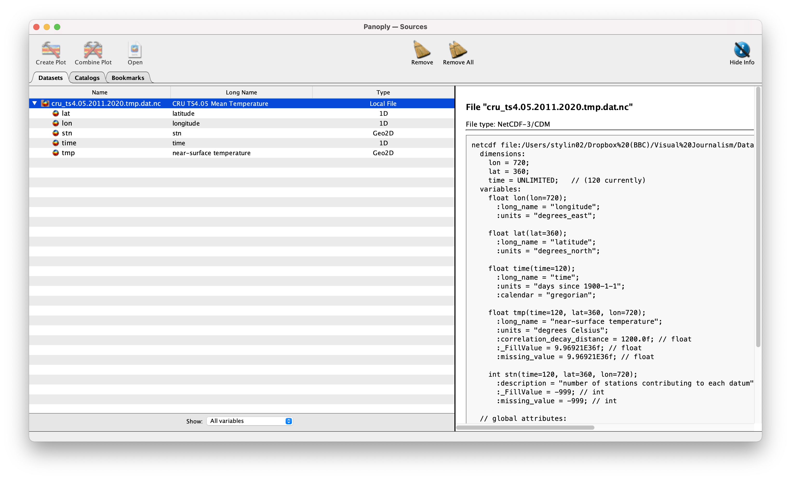
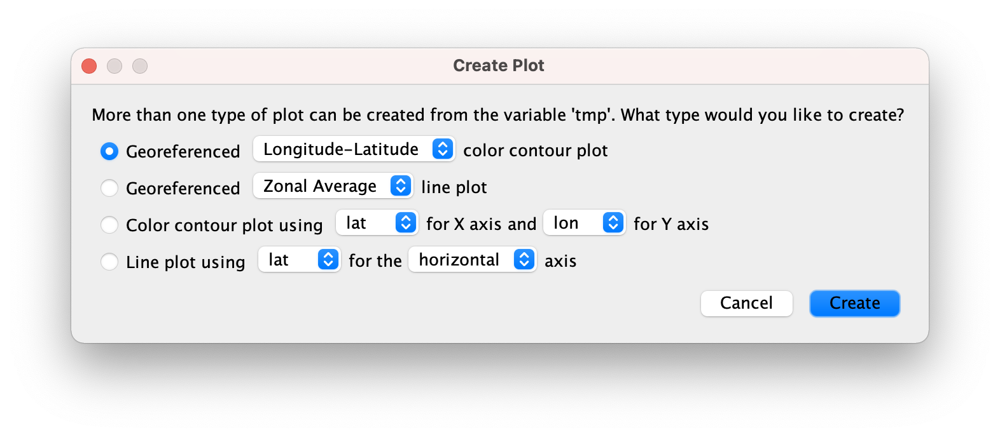
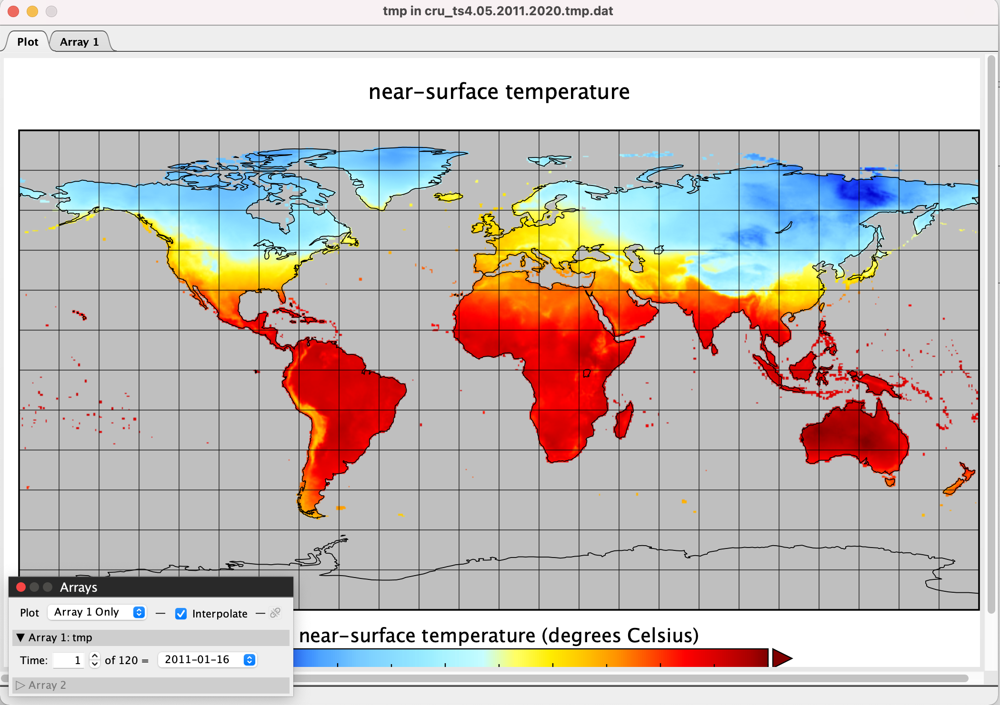
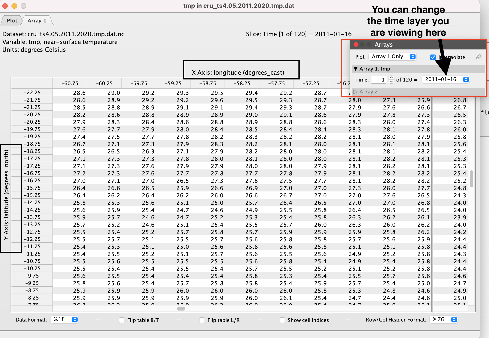
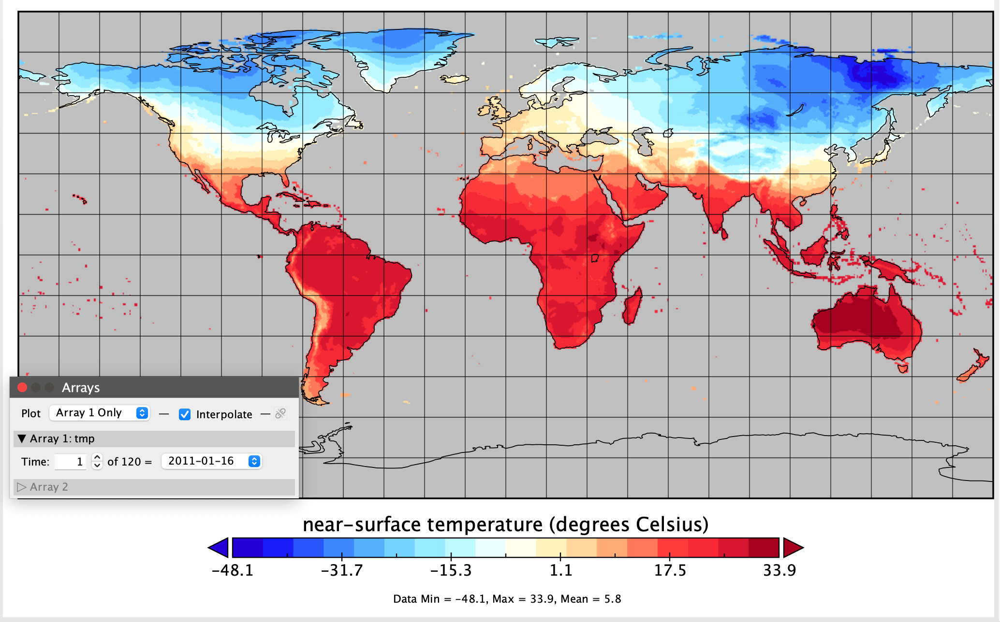
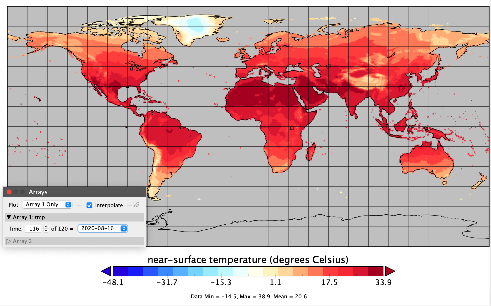
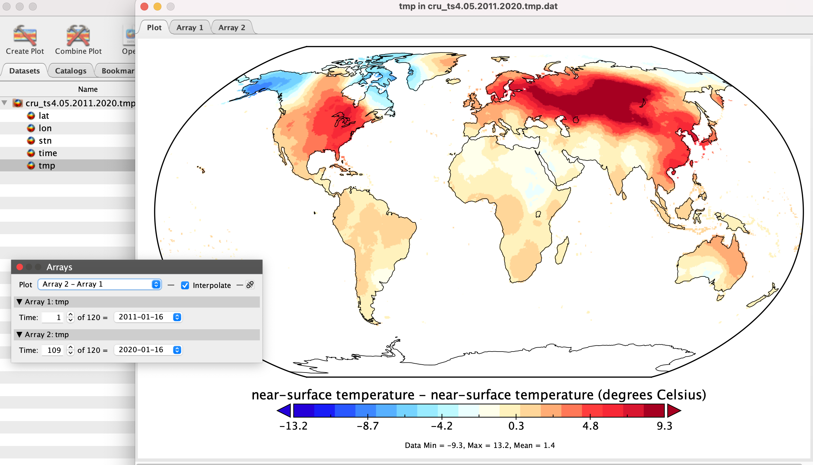

```{r setup, include=FALSE}
knitr::opts_chunk$set(echo = TRUE)
```

## What is gridded climate data? 

A lot of climate data is often stored in a gridded format. This is when a geographical area is split up into a grid made up of square cells, with data values (could be variables like temperature or precipitation) assigned to each cell in that grid representing the value for the area of the cell. Gridded climate data also tends to have separate layers, one for a different period of time.

## What are netCDF files?

One of the most common file formats used to store gridded climate data, such as those generated by climate simulation or reanalysis models, is the *Network Common Data Form*, or [netCDF](https://www.unidata.ucar.edu/software/netcdf/), often stored with the suffix `.nc`. You may often see it described as `netCDF4`, which is the latest version of the netCDF data format and collection of associated software libraries. 

NetCDF files contain metadata that describes what is contained in a file, such as the latitude and longitude layout of the grid, the names and units of variables in the data set, and “attributes” that describe things like missing value codes, or offsets and scale factors that may have been used to compress the data. 

The first thing to get your head round before diving in is the structure of a netCDF file. They are multi-dimensional arrays, which often hold data in numerous 'bands', these tend to be related to time, for example there could be one band for each month or year, and each band tends to have three dimensions, which tend to be latitude, longitude and the value (temperature, rainfall, number of days over X degrees or whatever else).

## How can you work with gridded data?

There are a number of different ways, software and packages to work with gridded climate data and specifically netCDF files. In both Python and R, there are a number of libraries that make working with gridded data and multi-dimensional arrays easier. You can also useGIS software like [QGIS](https://qgis.org/en/site/) to view and work with gridded data  - they are pretty much raster files. Software like [Panoply](https://www.giss.nasa.gov/tools/panoply/), developed by NASA, is also a great to get an initial feel of the data and visualise it.

## Viewing your data in Panoply

As mentioned, you want to get familiar with the structure of your netCDF file. We will go through all of this in R as well, but it sometimes really help to first see it visually, and Panoply is a real help. 

To have a quick look at the shape and visual impact of the data, it probably makes sense to load it into Panoply.



When you open the Panoply application, it will ask you to load a file - you should navigate to the folder in your local directory where the file is located, select it and click Open.
So after opening Panoply and selecting the file we want to view, you can see that the variables are on the left and also the metadata is on the right. 

   

From here, you can examine the dimensions of your data, that it has 720 longitude units (formatted in degrees east rather, so 0 to 360 rather than the more digital map -180 to 180), 120 units of time (which is one every month from 2011 to 2020) and much more. The more you explore this and the more you get used to the formats, the more you can read into them and understand, so don't worry if not too much makes sense at this stage. 

Now if you double-click on the 'near-surface temperature' variable, which is essentially the variable with the values you want, you will get a pop-up with some options for what exact plot you want to show. 

  

### Making maps
We want to see it on a map, so we keep the default selection which is to 'create a georeferenced Longitude-Latitude plot', a.k.a a map :)

And this is what you should see when you click Create - this may be slightly different based on your default settings.

 

We will get back to what the map shows, all our options and and making it look nice in a bit, but if you click on the Array 1 tab on the top right, you can see the data as a table. We can see a large number of NAs in our data, because our file has no data for the ocean, but if we scroll we can see the data it holds at longitudes and latitudes covered by land. 


 

So as you can see from the annotation, you can change the time band and in this way look at another year - as well as playing around with the colour scales, defaults and the like to get the map looking nicer through the options in the `Window` menu. 


An important thing to bear in mind - in the scale option, make sure that for your scale range, the min and max are adjusted to 'fit to data', when looking at doing individual plots - as you may not want the scale for the entire dataset to be the same for different layers (we have kept it the same in the examples below to compare the temperature from the different months).

#### January 2011
 

#### August 2020

 

So if you experiment with it, Panoply does offer a few options to modify the map, changing projection, breaks etc so you could in fact export a series of maps from here as vectors (PDF) and work with them in Illustrator to modify and have your visualisations directly from here potentially. 

It will even let you do some basic calculations, by checking the 'Combine Plot' option at the top, you can add more layers to your data and do calculations with the individual layers (arrays) you have chosen. For example, the screenshot below shows a combined plot showing the difference in the January 2020 temperature data and the 2011 January temperature data. 


 
But to really explore your data and run more comprehensive statistical analyses on that data, we can bring it into R and examine it there, which is what we will be doing in the next section. 

## Working with your data in R

There are a number of different packages in R that allow you to load in and work with gridded netCDF files. Packages like the `raster` package, or the relatively newer `tidync` help do a lot of the heavy loading, but it is crucial to really understand how these multi-dimensional array files are structured first up, which is what we will go through now, mainly using the functions from the `ncdf4` R package. 

### Load the packages you need

```{r load_libs, warning = FALSE, message = FALSE}
library(ncdf4) # package for netcdf manipulation
library(raster) # package for raster manipulation
library(RNetCDF) # package for working with netcdfs
library(rgdal) # package for geospatial analysis
library(chron) #package to help with time conversions
library(dplyr) #package for data manipulation in R
library(lubridate) #package  for working with dates in R

```


### Reading a gridded file into R (nc_open from ncd4)

You can open a netcdf file using the `nc_open()` function from the `ncdf4` library. 

At its simplest, all you need is the filepath of your netcdf file, and the data from the file into a new variable you can access in R. 

The file we are using is inside our `data` folder. So all you need to do to load it in is run the code below, which loads the netCDF file and saves it as a variable we are calling `nc_data`:

``` {r load_data}

# This loads the data in and saves it to a variable called nc_data
nc_data <- nc_open('~/Dropbox (BBC)/Visual Journalism/Data/2022/working_with_climate_data_nicar22/data/cru_ts4.05.2011.2020.tmp.dat.nc')

# To see some basic information about the data, print out the file. 
print(nc_data)

```

When you print the variable, you will see some basic information about the netCDF, which resembles the metadata of the file. It does not print the data as a standard dataframe would for example. You can also gain an insight into the complicated structure of the information stored. 

We can see that there are two variables, the `tmp` variable in degrees Celsius, which is the surface temperature, and the `stn` variable, which is the "number of stations contributing to each datum". 

The data is structured in three dimensions: longitude (`lon`), latitude (`lat`) and time, which is what we will look at first.

We can also find the names of the different dimensions and variables in R, if we run `View(nc_data)`. Running the `View()` function should open up a new tab in R, which shows us all the different list elements of the netCDF file. You can click on the `dim` and `var` lists to see the names of the dimensions and variables.

NetCDF files and the data within them are naturally raster 'slabs' (a longitude by latitude “slice”), bricks (a longitude by latitude by time), or 4-d arrays (e.g. a longitude by latitude by height by time), while most data analysis routines in R expect 2-d variable-by-observation data frames.

So, what we will be doing next is to look at how to extract and work with each of the dimensions and variables, how they are structured before  re-shaping it from its list/raster format to a more 'rectangular', dataframe-like format. 

### Extracting variables 

To extract data from the netCDF, we can use the `ncvar_get()` function, also from the `ncdf4` package. The first argument you should pass to the function is the name of your netCDF file in R (the name you have given the netCDF file you have brought into R using the `nc_open` function) and the second argument is the name of the variable (dimension in this case) we want to extract. The `ncvar_get()` function actually extracts the data as arrays, so we will need to do some formatting to them later on to change the data type. 

#### Longitude  

So let's start with the longitude. We know that the longitude is stored in the variable/dimension called "lon" as we can see that in the metadata above, under the dimensions.


``` {r lon_variable, message = FALSE, warning = FALSE}

# The line of code below extracts the longitude variable from the netcdf file as an array into the lon variable.
lon <- ncvar_get(nc_data,"lon")

# Using the dim() function and passing our new lon variable to it gives us the dimensions of the l and saves it to the nlon variable.
nlon <- dim(lon)

# These functions just give you some insight into the data within lon 
head(lon)
tail(lon)
max(lon)
min(lon)

```

Running the different `head`, `tail`, `max` and `min` functions will show you the first few and last few latitude and longitude values for your data, which are in essence the centre points of your grid in the raster dataset. 

You can also see that `the ncvar_get()` function has actually extracted the data as a 1D array. 

#### Latitude 

We then need to do the same with the latitude, to have both the longitude and latitude in different variables. Again, we've seen above that the latitude data is stored within the `lat` dimension. 

``` {r lat_variable, message = FALSE, warning = FALSE}

# The line of code below extracts the latitude variable from the netcdf file as an array into the lat variable.
lat <- ncvar_get(nc_data,"lat")
# Using the dim() function and passing our new lat variable to it gives us the dimensions of the lat and saves it to the nlat variable.
nlat <- dim(lat)
# These functions just give you some insight into the lat variable
head(lat)
tail(lat)
max(lat)
min(lat)

```


#### Time 

The next step is to extract the time variable from your dataset - this is a little trickier because the time variable will need to be interpreted based on the time units, it is rarely a straightforward 'date' when working with climate data. 

To find out what time unit you are dealing with for the specific dataset in question, a lot of the time this should be in the metadata information that you get when you `print()` the netCDF dataset after you have loaded it in. So if we  look at the information printed out for this dataset, you can see the `units` for the `time` dimension are `days since 1900-1-1`.


``` {r time_variable, message = FALSE, warning = FALSE}

time <- ncvar_get(nc_data,"time")

time

```

So if we look at our time data when we print it out after we have extracted it using, we get a number like `40557`, as you can see above. We know from the information we have that number represents days since the 1 January 1900. 

This will need to be factored in to convert the formats a little later on, as it will be really useful to use the actual date when we are working with the data.  

To actually turn the units from the time dimension into a variable, we use the `ncatt_get()` function to extract the units attribute

``` {r time_variable_units, message = FALSE, warning = FALSE}

tunits <- ncatt_get(nc_data,"time","units")

# And just like the lat and lon, we can get the time variable dimensions as well using the dim() function.
ntime <- dim(time)

```


### Converting the time variable 

So before reshaping the data format to a 2D dataframe format we can work with, we will need to convert the time variable.

The time variable in “time-since” units can be converted into actual time values by splitting the time tunits$value string into its component parts, and then using the `chron()` function to determine the absolute value of each time value from the time origin.

``` {r reshaping_Time, message = FALSE, warning = FALSE}
# example of how we can convert time -- split the time units string into fields
tustr <- strsplit(tunits$value, " ")
tdstr <- strsplit(unlist(tustr)[3], "-")
tmonth <- as.integer(unlist(tdstr)[2])
tday <- as.integer(unlist(tdstr)[3])
tyear <- as.integer(unlist(tdstr)[1])

time_cols <- chron(time, origin=c(tmonth, tday, tyear)) %>%
  lubridate::mdy() %>%
  as.character()

```

So if you look at the time values in days since, this is what you get:

``` {r original_time, message = FALSE, warning = FALSE}
print(time)

```


If we print out the converted time, this is what we get:

``` {r converted_time, message = FALSE, warning = FALSE}

print(time_cols)

```

So you can see that the time-stamps for the particular set of data is The “time-stamp” for this particular data set is the mid-point of the interval for each month of the year for 2011 to 2020. There are other ways in which the “time” associated with a long-term mean is represented in climate stats, but essentially the code above shows us how to change the date format from days since to an actual date - whatever that date ends up representing.

A note on time and formatting - bear in mind there are a number of different ways that time data will be represented and you can turn it into more meaningful date formats in different ways once you understand that date pattern. You do not always have to change the dates in the way it was done above by unlisting and string spliting, so always be ready to adapt.

#### Data variable - temperature

We can extract the data from the array in a very similar way. We know the data variable we are after (temperature) is called `tmp`, so we can use the same `ncvar_get()` function as we have done to extract our three dimensions of lon, lat and time. 

``` {r tmp_variable, message = FALSE, warning = FALSE}

tmp_array <- ncvar_get(nc_data, "tmp")

```

If we look at all our global environment variables now, we have the longitude, latitude, time, and temperature arrays. You can now get an understanding of the dimensions of each of them and how they will fit in together. The temperature array is a 3D array and matches the dimensions of the lon, lat and time ones, which are 1D arrays. 

So essentially, the dimensions of the array are 720 lons, 360 lats and 120 times (10 years, 12 months for each year).

You can verify this by running `dim(tmp_array)` and the dims of each variable.

The other really useful thing to find out about your temperature data variable at this stage is what potential fill value was used for missing data. This is a common feature of some netcdf files which may be different to standard dataframes in R. You can find the fill value by running the `ncatt_get()` function as below - the name of your data as the first argument, the name of your variable as the second argument and "_FillValue" as the third argument

``` {r fill_value, message = FALSE, warning = FALSE}

# Finds the fill value used for missing data for the precipitation variable
fillvalue <- ncatt_get(nc_data, "tmp", "_FillValue")
fillvalue
```

The fill value in this particular case is `9969209968386869046778552952102584320`.

The best thing to do is probably first, might just be for housekeeping, replace any fill values with 'NA's, as would be standard practice in R. Here's how:

``` {r fill_value_assign, message = FALSE, warning = FALSE}
# Finds the fill value used for missing data for the temperature variable
tmp_array[tmp_array == fillvalue$value] <- NA

```


### Reshaping your data into a dataframe

The first step in the process is to convert the array into a vector - the code and process below will only work only if the netCDF file - and by default the data array - follows the “CF” conventions, i.e. that the variable has been defined to have dimensions nlon by nlat by nt, in that order. We have seen from interrogating our data above, that this is the case for our data - and most netCDF data you will encounter should follow the same format.

So if you remember from earlier, we had turned our data into a really large 'temperature' array by identifying the variable where the precipitation data was held and using the `ncvar_get()` function. 

This is what we had done: `tmp_array <- ncvar_get(nc_data,"tmp")`

So once we have our array, what we then need to do is turn it into a vector

``` {r vector_conversion, message = FALSE, warning = FALSE}

tmp_vector_long <- as.vector(tmp_array)

```

To check just how long this vector is, run `length(tmp_vector_long)` - and you can see that the length is **31104000**.

So we know that our data is made up of latitude, longitude, time and temperature variables. We know that we have 120 time values (12 months over 10 year) and the number of rows will be the number of longitude values by the number of latitude values, as these are grids.

So we then reshape the vector into a matrix based on this logic and using the nlon, nlat and ntime values we created earlier when evaluating our netcdf dataset.


``` {r matrix_conversion, message = FALSE, warning = FALSE}
# reshape the vector into a matrix
tmp_matrix <- matrix(tmp_vector_long, nrow=nlon*nlat, ncol=ntime)

dim(tmp_matrix)

```

So in total this should give us a matrix sized 259200 (720 lons x 360 lats) by 120 (time), which adds up to **31104000** from earlier. Bear in mind that we are not just multiplying these two values (720 by 360) to get our number of rows when creating the matrix, as the number of rows will depend on the number of latitude and longitude sized grids, so we use the variables `nlon` and `nlat` we created that are specific to the dimensions of this specific dataset.

Then reshape that vector into a 259200 by 120 matrix using the `matrix()` function, and verify that those are its dimension.

S0 lets see what our matrix actually looks like - lets check it without the NAs, as a lot of the NAs would be for values in the sea, of which there are many.

``` {r print_matric, message = FALSE, warning = FALSE}

head(na.omit(tmp_matrix))

```

So this matrix is basically the temperature data only, so we now need to add the latitude and longitude values to this, which we can do by creating a second dataframe and binding the two together.


``` {r lon_lat_matrix, message = FALSE, warning = FALSE}
# creating lon lat matrix
lonlat_matrix <- as.matrix(expand.grid(lon,lat))

# bind the two matrices together and turn into a dataframe
tmp_dataframe <- data.frame(cbind(lonlat_matrix, tmp_matrix))

```

Essentially, as you can see the dataset starts in the far corners of the world in a WGS84 system, hence the NAs as there are no values for the ocean in our dataset.

The other thing that you can see is that there are no column names - so we can set these ourselves. We know the first two columns are the longitude and latitude, as when we joined up the lonlat matrix with the tmp matrix, we put the lonlat matrix first. Then, the column names for each of the tmp columns are the time columns, so each of the individual layers in the netCDF that we saw visualised when we explored our data using Panoply. This is where our time conversion comes into use, as we can use that to set our column names.

``` {r column_names, message = FALSE, warning = FALSE}
lon_lat_cols <- c("lon", "lat")

tmp_cols <- c(lon_lat_cols, 
              time_cols)

colnames(tmp_dataframe) <- tmp_cols


```

### Calculations with the raster package

We can also work with our dataset using functions from the `raster` package. If we load the data in using the `brick` function of the raster package, the netCDF file is loaded in as a [RasterBrick object](https://rspatial.org/raster/pkg/2-classes.html#rasterstack-and-rasterbrick), a type of object that can hold several layers of data. Because our data, as we have seen earlier, has two variables, we can explicitly select the `tmp` variable, otherwise it will select one for us and provide a message with the variable the function has chosen. 

``` {r brick, warning = FALSE, message = FALSE} 
tmp_monthly <- brick('~/Dropbox (BBC)/Visual Journalism/Data/2022/working_with_climate_data_nicar22/data/cru_ts4.05.2011.2020.tmp.dat.nc', varname = "tmp")

print(tmp_monthly)
```
If we have a quick try and visualise our data, we can see that we get a plot for each month. To see just one month, we can select the index to select that layer and we know there are 120 layers, so we can select any layer from 1 to 120. 

``` {r brick_plot, warning = FALSE, message = FALSE} 

plot(tmp_monthly)

plot(tmp_monthly[[1]])

plot(tmp_monthly[[120]])

```

The [stackApply](https://search.r-project.org/CRAN/refmans/raster/html/stackApply.html) function is useful to apply a function on subsets of RasterBricks. It comes in handy here as it allows us to run calculations on the data to produce a single layer each year, rather than each month. We first create a vector that can act as an index for each year and then using the years as an index in the stackApply function, can run a mean function on each of the years. 

And you can see when we plot the annual dataset, that it prints out just 10 plots, one for each year, instead of the 120, one for each month

``` {r stackapply, warning = FALSE, message = FALSE} 
# creates vector as index for calculating yearly averages

years <- rep(1:10, each = 12)

# calculates average for each year, resulting in 10 layers one for each year from 2011 to 2020
tmp_annual <- stackApply(tmp_monthly, indices = years, fun = mean)


plot(tmp_annual)


```

We can at this stage convert the data to a spatial data frame for further analysis and plotting, or to save out as a shapefile or geojson. 

When we print out the annual df file, we can see it shows us that we have 10 variables, one for each year, which are named by year, rather than index_1, index_2 etc. 

``` {r spatial_df, warning = FALSE, message = FALSE} 
#turn into spatial polygons data frame
tmp_annual_df <- as(tmp_annual,
                  "SpatialPolygonsDataFrame")

# turn names of variables in the data frame as years
names(tmp_annual_df@data) <- c(as.character(2011:2020))

print(tmp_annual_df)

``` 

We can also split the data by subsetting it, creating two different files for the years 2011 to 2015 and 2016 to 2020 and calculating the total average for each. 


``` {r averages_calc, warning = FALSE, message = FALSE} 
# subsets years 2011 to 2015, the first 5 years in our annual data
tmp_annual_2011_2015 <- subset(tmp_annual, 1:5)

# calculates the mean for the five years we have subset
tmp_2011_2015_avg <- calc(tmp_annual_2011_2015,
                        mean,
                        na.rm = TRUE) 

# subsets years 2016 to 2020, years 6 to 10 in our annual data
tmp_annual_2016_2020 <- subset(tmp_annual, 6:10)

# calculates the mean for the five years we have subset
tmp_2016_2020_avg <- calc(tmp_annual_2016_2020,
                        mean,
                        na.rm = TRUE) 
``` 

So now, we can compare the average for the first five years of our data to the last five years and figure out the difference in mean temperature between the two, an example of the type of calculations we can get into with our data formatted in this way. 

We can see when plotting the new map, or printing out the results, that the values show the difference between the two averages, as opposed to the mean temperature averages.

``` {r calculate_diff, warning = FALSE, message = FALSE}
# calculates the difference between the two averages 
tmp_avg_diff <- tmp_2016_2020_avg - tmp_2011_2015_avg
print(tmp_avg_diff)
plot(tmp_avg_diff)

tmp_avg_diff_df <- as(tmp_avg_diff, 
                    "SpatialPolygonsDataFrame")

```

We can also export the data as a tiff, if we want to style up the end in software like QGIS.

``` {r export_geotiff, eval = FALSE}
# export as GeoTIFF
writeRaster(tmp_avg_diff, 
            filename="tmp_avg_diff.tiff", 
            format = "GTiff",
            overwrite = TRUE)

```
